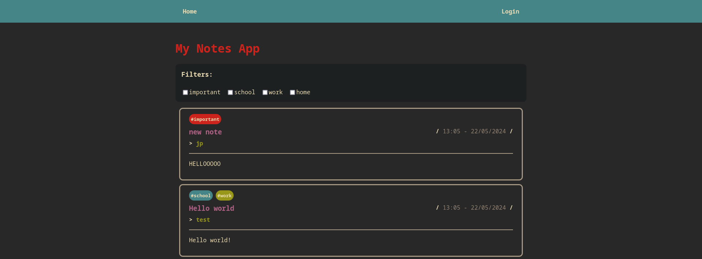
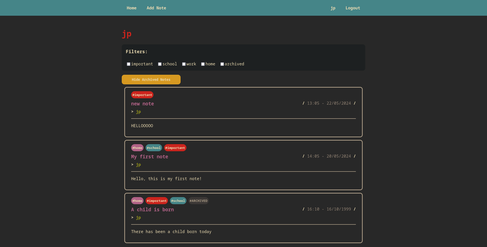
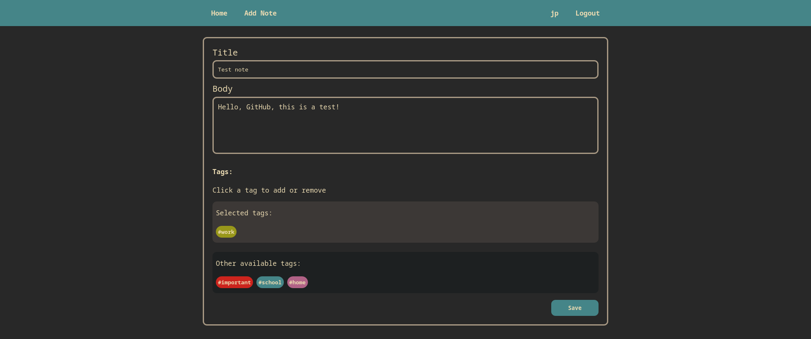
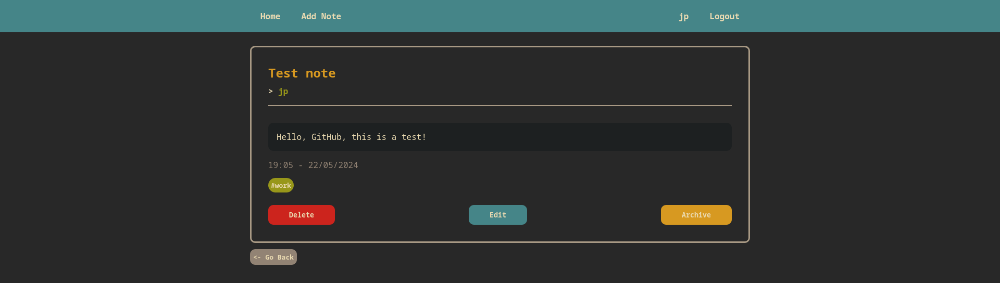

# Full Stack Implementation Exercise

To start the services, simply run the script `start.sh`, make sure that you have execution rights for both `start.sh` and `setup_db.sh` and that the postgres server is running.

```bash
sudo systemctl start postgresql
chmod u+x start.sh setup_db.sh
./start.sh
```

_All running and testing was done in Fedora 40, the command to start the postgres server may be different on your distribution._

If you get an error connecting to Postgres, take a look inside `.env` to check that the credentials and host are correct.

The front-end server will be running on port `8000` while the back-end on port `3000`.

## Login

There is no login validation, as such, entering any username and password will work. However, you will only be able to edit a note as well as see archived notes if the username matches the creator.

## Improvements

I had a great time working on this project, however, there are a few things which I would like to improve, if I continued to work on it:

-   Adding functional users. As it is now, there is no validation for username or password.
-   Better error handling on the backend.
-   Responsive design. The current design is desktop first, and while there are some elements that shrink and grow depending on screen size, it would become unusable on mobile.
-   The ability for users to create tags. Right now, tags--while saved on the server--can't be modified by the users.
-   Deployment. I would've like to the deploy the app so that anyone could access it from their own device without having to download and install it from GitHub.

## Images

Here are some images of the page working:










## Technologies used

### Frontend

```
-   React 18.3.1
-   @reduxjs/toolkit 2.2.5
-   @testing-library/jest-dom 5.17.0
-   @testing-library/react 13.4.0
-   @testing-library/user-event 13.5.0
-   axios 1.7.1
-   react 18.3.1
-   react-dom 18.3.1
-   react-redux 9.1.2
-   react-router-dom 6.23.1
-   react-scripts 5.0.1
-   sass 1.77.2
```

### Backend

```
-   NodeJS
-   PostgreSQL 16.1
-   Nodemon 3.1.0 (For development only)
-   pg 8.11.5
-   dotenv 16.4.5
-   cors 2.8.5
-   express 4.19.2
-   morgan 1.10.0
```
